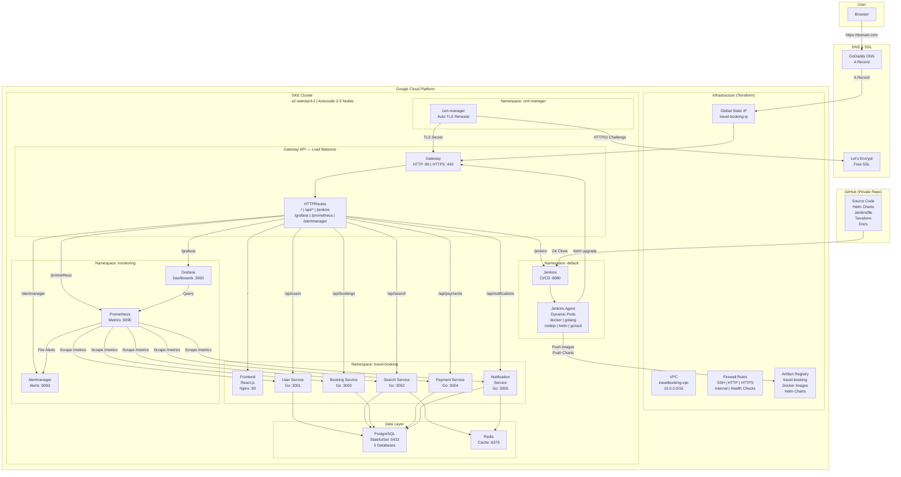
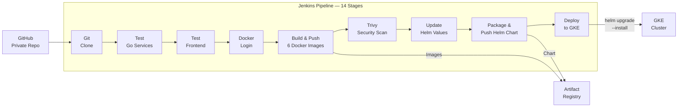

# TravelBooking — Full-Stack Microservices Travel Booking Platform

A production-grade travel booking application built with microservices architecture, deployed on Google Kubernetes Engine (GKE) with a complete DevOps lifecycle — Terraform, Helm, Jenkins CI/CD, Prometheus & Grafana monitoring, and HTTPS with Let's Encrypt.

---

## Architecture Overview



---

## CI/CD Pipeline Flow (Jenkins)



---

## Tech Stack

| Layer | Technology |
|-------|-----------|
| **Frontend** | React.js 18, Tailwind CSS, Nginx |
| **Backend** | Go 1.21, Gin Framework, GORM |
| **Database** | PostgreSQL 15 (5 databases) |
| **Cache** | Redis 7 |
| **Container** | Docker (multi-stage builds) |
| **Orchestration** | Kubernetes (GKE) |
| **Infrastructure** | Terraform (modular) |
| **Packaging** | Helm Charts |
| **CI/CD** | Jenkins (on GKE) |
| **Monitoring** | Prometheus, Grafana, Alertmanager |
| **TLS/SSL** | cert-manager, Let's Encrypt |
| **DNS** | GoDaddy |
| **Registry** | Google Artifact Registry |
| **Version Control** | GitHub (private) |

---

## Microservices

| Service | Language | Port | Database | Purpose |
|---------|----------|------|----------|---------|
| **Frontend** | React.js | 80 | - | User interface |
| **User Service** | Go | 3001 | userdb | Registration, login, JWT auth |
| **Search Service** | Go | 3002 | searchdb | Flight & hotel search, Redis cache |
| **Booking Service** | Go | 3003 | bookingdb | Create & manage bookings |
| **Payment Service** | Go | 3004 | paymentdb | Payment processing |
| **Notification Service** | Go | 3005 | notificationdb | Booking notifications |
| **PostgreSQL** | - | 5432 | 5 DBs | Data storage (StatefulSet) |
| **Redis** | - | 6379 | - | Search cache & message queue |

---

## Kubernetes Resources (Helm Chart)

| Resource | Count | Purpose |
|----------|-------|---------|
| Deployments | 7 | Application containers |
| StatefulSet | 1 | PostgreSQL with persistent storage |
| Services | 8 | Internal networking |
| ConfigMaps | 6 | Environment variables |
| Secrets | 5 | DB passwords, JWT secrets |
| HPAs | 6 | Auto-scaling (1-5 replicas) |
| Gateway | 1 | GCP Load Balancer |
| HTTPRoutes | 6 | URL path routing |

---

## GCP Infrastructure (Terraform)

| Resource | Name | Purpose |
|----------|------|---------|
| VPC | travelbooking-vpc | Network isolation |
| Subnet | travelbooking-subnet | 10.0.0.0/16 CIDR |
| Firewall | 4 rules | SSH, HTTP/S, Internal, Health Checks |
| GKE Cluster | travelbooking-gke | Kubernetes with Gateway API |
| Node Pool | e2-standard-2 | Autoscale 2-5 nodes |
| Artifact Registry | travel-booking | Docker images & Helm charts |
| Static IP | travel-booking-ip | Global IP for Gateway |

---

## Monitoring Stack

| Tool | Purpose | Access |
|------|---------|--------|
| **Prometheus** | Metrics collection (15s scrape interval) | /prometheus |
| **Grafana** | 6 custom dashboards + Kubernetes dashboards | /grafana |
| **Alertmanager** | Alert rules: PodDown, HighCPU, HighMemory, HTTPErrors | /alertmanager |
| **ServiceMonitors** | Auto-discover & scrape 5 Go services | - |
| **Node Exporter** | Node-level CPU, memory, disk metrics | - |
| **kube-state-metrics** | Pod, deployment, service status metrics | - |

---

## Project Structure

```
travelbooking/
├── frontend/                  # React.js frontend
├── user-service/              # Go — user management & JWT auth
├── search-service/            # Go — flight & hotel search with Redis cache
├── booking-service/           # Go — booking management
├── payment-service/           # Go — payment processing
├── notification-service/      # Go — notifications
├── postgres/                  # Database init script (5 databases)
├── nginx/                     # Reverse proxy config (local dev)
├── helm/travel-booking/       # Helm chart for Kubernetes deployment
├── gcp-terraform/             # Terraform modules for GCP infrastructure
├── jenkins/                   # Jenkins Helm values & setup guide
├── monitoring/                # Prometheus, Grafana, alerts, dashboards
├── https/                     # cert-manager & Let's Encrypt config
├── docs/                      # All documentation
│   ├── postgresql-database-guide.md
│   ├── gateway-api-dns-guide.md
│   ├── docker-compose-local-setup-guide.md
│   └── https-setup-guide.md
├── docker-compose.yml         # Local development setup
├── Jenkinsfile                # CI/CD pipeline (14 stages)
└── Makefile                   # Build commands
```

---

## Deployment Order

```
1. Terraform       → Create VPC, GKE, Artifact Registry, Static IP
2. Helm Chart      → Deploy TravelBooking app (8 pods)
3. Jenkins         → Install CI/CD on GKE
4. Monitoring      → Prometheus + Grafana + Alertmanager
5. DNS             → Point domain to Gateway IP (GoDaddy)
6. HTTPS           → cert-manager + Let's Encrypt + HTTP→HTTPS redirect
```

---

## Local Development

```bash
# Run the entire application locally
docker compose up -d --build

# Access at http://localhost:8080

# Stop
docker compose down
```

---

## Documentation

| Guide | Description |
|-------|-------------|
| [Helm Chart README](helm/travel-booking/README.md) | Helm commands & chart details |
| [Terraform README](gcp-terraform/README.md) | GCP infrastructure setup |
| [Jenkins Guide](jenkins/jenkins.md) | Jenkins installation & pipeline |
| [Monitoring Guide](monitoring/monitoring.md) | Prometheus & Grafana setup |
| [PostgreSQL Guide](docs/postgresql-database-guide.md) | Database queries & access |
| [Gateway & DNS Guide](docs/gateway-api-dns-guide.md) | Gateway API & domain setup |
| [HTTPS Guide](docs/https-setup-guide.md) | SSL/TLS with Let's Encrypt |
| [Docker Compose Guide](docs/docker-compose-local-setup-guide.md) | Local development setup |
