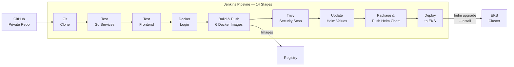

# TravelBooking — Full-Stack Microservices Travel Booking Platform

A cloud-native microservices-based travel booking application, deployed on Elastic Kubernetes Engine (EKS) with a complete DevOps lifecycle — Terraform, Helm, Jenkins CI/CD, Prometheus & Grafana monitoring, Amazon ECR, AWS Load Balancer Controller, ACM & Route53.

---

## About the Project

TravelBooking is a cloud-native microservices travel application where users can search flights and hotels, make bookings, and process payments — similar to MakeMyTrip or Booking.com. The main focus of this project is to showcase a complete DevOps lifecycle on Amazon Web Services (AWS).

🏗️ **Architecture** — The app is built using **microservices architecture** with 6 services — a React frontend and 5 Go backend services (user, search, booking, payment, notification). Data is stored in PostgreSQL with 5 separate databases (one per service), and Redis is used for caching search results.

☸️ **Kubernetes & Infrastructure** — Everything runs on **Amazon Elastic Kubernetes Service (Amazon EKS)**. The AWS infrastructure (VPC, subnets, security-groups, ECR Registry, EKS) is created using **Terraform** . The application is deployed using a custom **Helm chart** that creates all Kubernetes resources with one command.

⚙️ **CI/CD with Jenkins** — **Jenkins** runs inside the same EKS cluster and handles CI/CD. The 14-stage pipeline clones code from GitHub, tests services, builds and pushes Docker images to Artifact Registry, scans images with Trivy, packages the Helm chart, and deploys to GKE automatically.

📊 **Monitoring** — Set up with Prometheus, Grafana, and Alertmanager. Each service exposes metrics that Prometheus scrapes every 15 seconds. Grafana shows 6 custom dashboards, and Alertmanager fires alerts on pod failures, high CPU/memory, or HTTP errors.

🔒 **HTTPS & SSL** — Handled by AWS Certificate Manager (ACM) integrated with the AWS Load Balancer Controller.

🌐 **DNS & Domain Access** — The application is accessible through a custom domain managed via Amazon Route53 Alias records pointing to an AWS Application Load Balancer (ALB). with Hostinger domain

---

## Architecture Overview

```mermaid
flowchart TB
    subgraph USER["User"]
        BROWSER["Browser"]
    end

    subgraph DNS["DNS & SSL"]
        AWS["ROUTE 53 DNS\nA Record"]
        ACM["Let's Encrypt\nFree SSL"]
    end

    subgraph GCP["Google Cloud Platform"]

        subgraph TERRAFORM["Infrastructure (Terraform)"]
            STATICIP["Global Static IP\ntravel-booking-ip"]
            VPC["VPC\ntravelbooking-vpc\n10.0.0.0/16"]
            ARTIFACTREGISTRY["ECR Registry\ntravel-booking\nDocker Images\nHelm Charts"]
        end

        subgraph EKS["EKS Cluster\ne2-standard-2 | Autoscale 2-5 Nodes"]

            subgraph GATEWAY["AWS Load Balancer Controller — Application Load Balancer (ALB)"]
                ALB["Application Load Balancer\nHTTP :80 | HTTPS :443"]
                ROUTES["HTTPRoutes\n/ | /api/* | /jenkins\n/grafana | /prometheus | /alertmanager"]
            end

            subgraph APP["Namespace: travel-booking"]
                direction LR
                FE["Frontend\nReact.js\nNginx :80"]
                US["User Service\nGo :3001"]
                SS["Search Service\nGo :3002"]
                BS["Booking Service\nGo :3003"]
                PS["Payment Service\nGo :3004"]
                NS["Notification\nService\nGo :3005"]
            end

            subgraph DATA["Data Layer"]
                PG["PostgreSQL\nStatefulSet :5432\n5 Databases"]
                RD["Redis\nCache :6379"]
            end

            subgraph JENKINS["Namespace: default"]
                JK["Jenkins\nCI/CD :8080"]
                AGENT["Jenkins Agent\nDynamic Pods\ndocker | golang\nnodejs | helm | awscli"]
            end

            subgraph MON["Namespace: monitoring"]
                PROM["Prometheus\nMetrics :9090"]
                GRAF["Grafana\nDashboards :3000"]
                ALERT["Alertmanager\nAlerts :9093"]
            end

            subgraph (ACM)["AWS Certificate Manager "]
            end

        end
    end

    subgraph GITHUB["GitHub (Private Repo)"]
        REPO["Source Code\nHelm Charts\nJenkinsfile\nTerraform\nDocs"]
    end

   

    ROUTES -->|"/"| FE
    ROUTES -->|"/api/users"| US
    ROUTES -->|"/api/search"| SS
    ROUTES -->|"/api/bookings"| BS
    ROUTES -->|"/api/payments"| PS
    ROUTES -->|"/api/notifications"| NS
    ROUTES -->|"/jenkins"| JK
    ROUTES -->|"/grafana"| GRAF
    ROUTES -->|"/prometheus"| PROM
    ROUTES -->|"/alertmanager"| ALERT

    US --> PG
    SS --> PG
    BS --> PG
    PS --> PG
    NS --> PG
    SS --> RD
    NS --> RD

    PROM -->|"Scrape /metrics"| US
    PROM -->|"Scrape /metrics"| SS
    PROM -->|"Scrape /metrics"| BS
    PROM -->|"Scrape /metrics"| PS
    PROM -->|"Scrape /metrics"| NS
    GRAF -->|"Query"| PROM
    PROM -->|"Fire Alerts"| ALERT

    
    CM -->|"TLS Secret"| ACM

    REPO -->|"Git Clone"| JK
    JK --> AGENT
    AGENT -->|"Push Images\nPush Charts"| ECR REGISTRY
    AGENT -->|"helm upgrade"| 
```

---

## CI/CD Pipeline Flow (Jenkins)



---

## Tech Stack

| Layer | Technology |
|-------|-----------|
| **Frontend** | React.js 18, Tailwind CSS, Nginx |
| **Backend** | Go 1.21, Gin Framework, GORM |
| **Database** | PostgreSQL 15 (5 databases) |
| **Cache** | Redis 7 |
| **Container** | Docker (multi-stage builds) |
| **Orchestration** | Kubernetes (EKS) |
| **Infrastructure** | Terraform (modular) |
| **Packaging** | Helm Charts |
| **CI/CD** | Jenkins (on EKS) |
| **Monitoring** | Prometheus, Grafana, Alertmanager |
| **TLS/SSL** | ACM |
| **DNS** | Hostinger |
| **Registry** | ECR Registry |
| **Version Control** | GitHub (private) |

---

## Microservices

| Service | Language | Port | Database | Purpose |
|---------|----------|------|----------|---------|
| **Frontend** | React.js | 80 | - | User interface |
| **User Service** | Go | 3001 | userdb | Registration, login, JWT auth |
| **Search Service** | Go | 3002 | searchdb | Flight & hotel search, Redis cache |
| **Booking Service** | Go | 3003 | bookingdb | Create & manage bookings |
| **Payment Service** | Go | 3004 | paymentdb | Payment processing |
| **Notification Service** | Go | 3005 | notificationdb | Booking notifications |
| **PostgreSQL** | - | 5432 | 5 DBs | Data storage (StatefulSet) |
| **Redis** | - | 6379 | - | Search cache & message queue |

---

## Kubernetes Resources (Helm Chart)

| Resource | Count | Purpose |
|----------|-------|---------|
| Deployments | 7 | Application containers |
| StatefulSet | 1 | PostgreSQL with persistent storage |
| Services | 8 | Internal networking |
| ConfigMaps | 6 | Environment variables |
| Secrets | 5 | DB passwords, JWT secrets |
| HPAs | 6 | Auto-scaling (1-5 replicas) |
| Ingress | 1 | AWS Load Balancer Controller |
| HTTPRoutes | 6 | URL path routing |

---

## AWS Infrastructure (Terraform)

| Resource | Name | Purpose |
|----------|------|---------|
| VPC | travelbooking-vpc | Network isolation |
| Subnet | travelbooking-subnet | 10.0.0.0/16 CIDR |
| Security-groups | 4 rules | SSH, HTTP/S, Internal, Health Checks |
| EKS Cluster | travelbooking-gke | Kubernetes with Gateway API |
| Node Pool | e2-standard-2 | Autoscale 2-5 nodes |
| ECR Registry | travel-booking | Docker images & Helm charts |


---

## Monitoring Stack

| Tool | Purpose | Access |
|------|---------|--------|
| **Prometheus** | Metrics collection (15s scrape interval) | /prometheus |
| **Grafana** | 6 custom dashboards + Kubernetes dashboards | /grafana |
| **Alertmanager** | Alert rules: PodDown, HighCPU, HighMemory, HTTPErrors | /alertmanager |
| **ServiceMonitors** | Auto-discover & scrape 5 Go services | - |
| **Node Exporter** | Node-level CPU, memory, disk metrics | - |
| **kube-state-metrics** | Pod, deployment, service status metrics | - |

---

## Project Structure

```
travelbooking/
├── frontend/                  # React.js frontend
├── user-service/              # Go — user management & JWT auth
├── search-service/            # Go — flight & hotel search with Redis cache
├── booking-service/           # Go — booking management
├── payment-service/           # Go — payment processing
├── notification-service/      # Go — notifications
├── postgres/                  # Database init script (5 databases)
├── nginx/                     # Reverse proxy config (local dev)
├── helm/travel-booking/       # Helm chart for Kubernetes deployment
├── AWS-terraform1/             # Terraform modules for GCP infrastructure
├── jenkins/                   # Jenkins Helm values & setup guide
├── monitoring/                # Prometheus, Grafana, alerts, dashboards
├── https/                     # cert-manager & Let's Encrypt config
├── docs/                      # All documentation
│   ├── postgresql-database-guide.md
│   ├── gateway-api-dns-guide.md
│   ├── docker-compose-local-setup-guide.md
│   └── https-setup-guide.md
├── docker-compose.yml         # Local development setup
├── Jenkinsfile                # CI/CD pipeline (14 stages)
└── Makefile                   # Build commands
```

---

## Deployment Order

```
1. Terraform       → Create VPC, EKS, ECR Registry, IAM Roles
2. Helm Chart      → Deploy TravelBooking app (8 pods)
3. Jenkins         → Install CI/CD on EKS
4. Monitoring      → Prometheus + Grafana + Alertmanager
5. DNS             → Route53
6. HTTPS           → ACM
```

---

## Local Development

```bash
# Run the entire application locally
docker compose up -d --build

# Access at http://localhost:8080

# Stop
docker compose down
```

---

## Documentation

| Guide | Description |
|-------|-------------|
| [Helm Chart README](helm/travel-booking/README.md) | Helm commands & chart details |
| [Terraform README](gcp-terraform/README.md) | GCP infrastructure setup |
| [Jenkins Guide](jenkins/jenkins.md) | Jenkins installation & pipeline |
| [Monitoring Guide](monitoring/monitoring.md) | Prometheus & Grafana setup |
| [PostgreSQL Guide](docs/postgresql-database-guide.md) | Database queries & access |
| [Docker Compose Guide](docs/docker-compose-local-setup-guide.md) | Local development setup |
